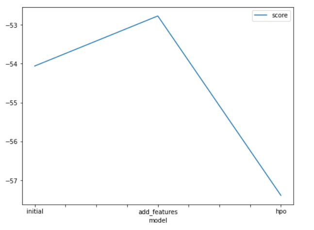

# Report: Predict Bike Sharing Demand with AutoGluon Solution
#### Ahmed Mohamed Ali Ramadan

## Initial Training
### What did you realize when you tried to submit your predictions? What changes were needed to the output of the predictor to submit your results?
TODO: Predictions needed to be greater than or equal to 0. That’s why clipping the predictions to have the lower boundary of zero was done. Also rounding the target ‘count’

### What was the top ranked model that performed?
TODO: WeightedEnsemble_L3

## Exploratory data analysis and feature creation
### What did the exploratory analysis find and how did you add additional features?
TODO: It was found that people rented bikes more from January to February 2011 and from Sep to Oct 2012.And the following hours (1-2.5 am, 7-9 am, 1-4 pm, 9-11 pm)

### How much better did your model preform after adding additional features and why do you think that is?
TODO: My score changed from 1.36730 to 0.48591
      ,This was mainly because of the drop of the correlated column and

## Hyper parameter tuning
### How much better did your model preform after trying different hyper parameters?
TODO: It's a small difference

### If you were given more time with this dataset, where do you think you would spend more time?
TODO: In tuning the model and normalization

### Create a table with the models you ran, the hyperparameters modified, and the kaggle score.
|model|hpo1|hpo2|hpo3|score|
|--|--|--|--|--|
|initial|default|default|default|1.36730|
|add_features|default|default|0.48591|
|hpo|'GBM':{'num_boost_round':100,'num_leaves': ag.space.Int(lower=26, upper=66, default=36),'objective':'huber','nu _iterations':200}|'KNN':{'n_neighbors':4,'weights':'distance','algorithm':'brute'}|'XGB': {'objective':'reg:pseudohubererror','eval_metric' :'rmse' }|0.54429
|

### Create a line plot showing the top model score for the three (or more) training runs during the project.

TODO: Replace the image below with your own.

### Create a line plot showing the top kaggle score for the three (or more) prediction submissions during the project.

TODO: Replace the image below with your own.

## Summary
TODO: 
Business Objective: Predict bike sharing demand.

Obtain Data from the "Bike Sharing Demand" kaggle competition.

Analyze and visualize data using Pandas, Matplotlib.

Build Model using Autogluon AutomML library.

Test Model Models are tested by submitting the predictions to Kaggle and compared the models based on the scroe obtained.

